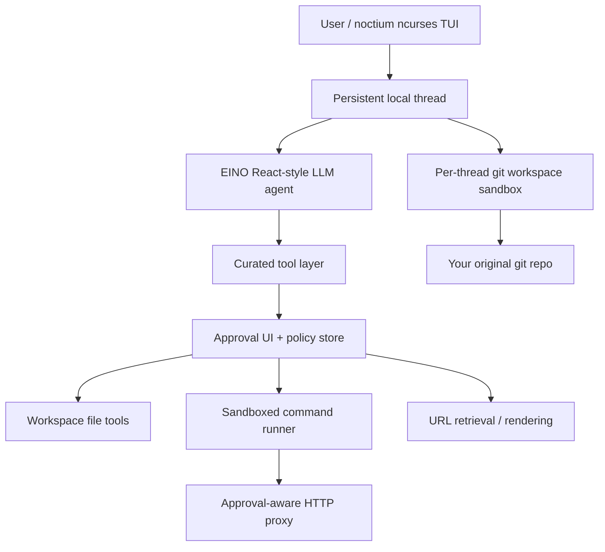

# Octium

[](https://github.com/mikeb26/octium/releases)
[](https://app.circleci.com/pipelines/github/mikeb26/octium)
[](https://pkg.go.dev/github.com/mikeb26/octium)
[](LICENSE)

**Octium is a Linux-only, local-first AI coding agent for developers who want a terminal-native workflow, persistent task threads, human approval gates, and git workspace isolation.**

Octium keeps agent work organized as resumable local threads and routes risky actions through explicit approvals. Unlike many coding agents that modify your checkout directly — and can accidentally rewrite or delete your work — Octium can link each thread to a separate git workspace sandbox, so agent changes happen away from your original working tree until you review, commit, push, or merge them.

> **Platform status:** Octium currently targets Linux only. The packaged install path assumes a modern Linux distro with `systemd`, `sudo`, `git`, and ncurses support. The apt repository currently publishes `amd64` packages and has been tested with Debian 12, Debian 13, Ubuntu 22.04 LTS, Ubuntu 24.04 LTS, and Ubuntu 26.04 LTS.

## Why Octium?

- **Terminal-native TUI** — `noctium` provides a full-screen ncurses interface with a thread menu, per-thread chat view, scrollback, and multiline input.
- **Persistent local threads** — start multiple agent tasks, let them run, archive them, search them, and resume them later.
- **Git workspace isolation** — work happens in a per-thread sandbox clone rather than directly in your repo checkout.
- **Human-in-the-loop approvals** — file, command, and network actions are approval-gated, with persisted policies when you want them.
- **Sandboxed command execution** — commands run through a dedicated sandbox user with a sanitized environment and an approval-aware network proxy.
- **Multi-vendor LLM support** — OpenAI, Anthropic, Google Gemini, and OpenRouter.
- **Concurrent Execution** — multiple threads within the same git repository, or different git repositories, can work concurrently.
- **Local state and auditability** — configuration, threads, approval policies, and optional audit logs live on your machine.

## Key features

### Ncurses terminal UI

- Thread list/menu with search.
- Per-thread chat view with scrollable history and multiline input.
- Multiple threads can be running or waiting for approval concurrently.
- In-app configuration for provider, model, reasoning effort, approvals, wrapping, and audit logging.

### Persistent threads

- Conversations and task state are stored locally on disk.
- Threads can be archived and unarchived.
- Current and archived threads can be searched.
- Multiple long-running tasks can continue while you navigate the UI independently

### Git workspaces: safer coding-agent workflow

Many coding agents operate directly in your working tree. That is convenient, but risky: a bad tool call can delete files, rewrite local changes, or leave your checkout half-modified.

Octium's workspace model is designed to put a review boundary between the agent and your repo:

1. Link a thread to a git repository.
2. Octium creates a separate sandbox clone for that thread.
3. The agent reads, edits, tests, and commits inside the sandbox.
4. You review the sandbox diff.
5. When ready, you can merge the changes back into your repo or push to a separate branch.

Workspace actions include:

- sync the sandbox from your repo
- show diffs for sandbox changes
- commit sandbox changes
- push sandbox commits to a branch in your repo
- merge sandbox commits into your current branch
- reset or relink the workspace sandbox
- open a terminal inside the sandbox

This makes Octium especially useful for experimenting with agent-generated code while keeping your original checkout protected.

### Agent toolset

Octium gives the agent a focused toolset instead of unrestricted access:

- run OS-level commands in the sandbox
- create, append, patch, read, and delete files inside the workspace
- retrieve web content with approval-gated URL/domain policies
- write large retrieved responses to workspace files instead to minimize wasting the context window
- best-effort JavaScript rendering for pages that require it via chromium

### Safety model

Octium is built around explicit human control of agent actions.

- File operations require approval and are scoped to the active workspace.
- File approvals can be granted once, for a file, or for a directory tree.
- URL access can be approved once, by exact URL, or by domain.
- Command execution can be configured to require approval, including per-command or exact-invocation policies.
- Commands run through a dedicated sandbox account via a privileged wrapper.
- Sandboxed command environments are heavily sanitized.
- Network access from sandboxed commands is routed through an approval-aware local HTTP proxy.
- Optional audit logs record prompts, model calls, and tool activity.

## Installation

### Debian / Ubuntu apt repository

The recommended install path on Debian/Ubuntu is the Octium apt repository:

```bash
sudo install -d -m 0755 /etc/apt/keyrings
curl -fsSL https://repo.octium.dev/octium-archive-keyring.gpg \
  | sudo tee /etc/apt/keyrings/octium-archive-keyring.gpg > /dev/null
echo "deb [arch=amd64 signed-by=/etc/apt/keyrings/octium-archive-keyring.gpg] https://repo.octium.dev stable main" \
  | sudo tee /etc/apt/sources.list.d/octium.list
sudo apt update
sudo apt install octium
```

The package installs the current Octium TUI binary as:

```bash
noctium
```

Package install also provisions a dedicated per-user sandbox account when possible. If your user is newly added to the Octium shared sandbox group, you may need to log out and back in, or run `newgrp <octium-user-shared-group>`, before workspace sandbox access is available in the current shell session.

Repository details are available at <https://repo.octium.dev/>.

### Prebuilt release artifacts

Prebuilt Linux release artifacts are also published on the [GitHub releases](https://github.com/mikeb26/octium/releases) page.

Use the apt repository when possible; it installs the package dependencies and sandbox provisioning helpers. Manual binary installs are mainly useful for development or experimentation and may not include the full sandbox setup.

### Build from source

Requirements:

- Linux
- Go 1.26.2 or newer
- `make`
- `git`
- `systemd` and `sudo` for sandboxed command execution
- ncurses development headers
- a C build toolchain usable by cgo

Build:

```bash
git clone https://github.com/mikeb26/octium.git
cd octium
make build
```

If you have never installed the `.deb` package, install the sandbox
provisioning helpers and create your per-user sandbox account before using
workspace or command-execution features. The source-built binary still expects
the privileged sandbox wrapper under `/usr/libexec/octium/`.

```bash
# Render the packaging helper templates used by the provisioner.
make pkg-generate

# Install the helper scripts and sandbox defaults.
sudo install -d -m 0755 /usr/libexec/octium /usr/share/octium
sudo install -o root -g root -m 0755 \
  pkg/common/libexec/octium-provision-user \
  /usr/libexec/octium/octium-provision-user
sudo install -o root -g root -m 0644 \
  pkg/common/libexec/run-as.template \
  /usr/libexec/octium/run-as.template
sudo install -o root -g root -m 0644 \
  pkg/common/share/gitconfig \
  /usr/share/octium/gitconfig
sudo install -o root -g root -m 0644 \
  pkg/common/share/bashprofile \
  /usr/share/octium/bashprofile

# Create /home/octium-$USER, the octium-$USER-shared group, the sudoers
# drop-in, and the per-user run-as wrapper.
sudo /usr/libexec/octium/octium-provision-user "$USER"
```

After provisioning, log out and back in, or run:

```bash
newgrp "octium-$USER-shared"
```

This lets your current shell pick up membership in the shared sandbox group.

Run the built TUI:

```bash
./noctium
```

Run tests:

```bash
make test
```

## Quickstart

After installing, start the TUI:

```bash
noctium
```

On first run, Octium will prompt you to choose an LLM vendor/model and enter an API key. Supported vendors are currently:

- OpenAI
- Anthropic
- Google Gemini
- OpenRouter

Once configured:

1. Create a thread with `n`.
2. Open the thread with Enter.
3. If prompted, link the thread to a git repository to create a workspace sandbox.
4. Ask Octium to inspect, modify, test, or explain code.
5. Approve file, command, or network actions as needed.
6. Review workspace diffs before pushing or merging changes back.

## Usage notes

- `noctium` requires a real TTY because it uses ncurses; it is not designed for non-interactive piping.
- Commands run by the agent are sandboxed and may not see your usual shell environment.
- Workspaces are most useful when launched from inside or near the git repository you want a thread to work on.

### Key bindings: thread menu

- Navigate: ↑/↓, PgUp/PgDn, Home/End
- Open selected thread: Enter
- New thread: `n`
- Search threads: `/` (ESC exits search)
- Archive/unarchive selected thread: `a` / `u`
- Configure vendor/model/API key and preferences: `c`
- Quit: ESC

### Key bindings: thread view

- Navigate: ↑/↓, PgUp/PgDn, Home/End
- Switch focus between history/input: Tab
- Send prompt: Ctrl-D
- Workspace menu: `w` when history is focused
- Rename thread: `n` when history is focused
- Return to menu / switch focus: ESC

## Example workflows

### Fix a failing test safely

1. Start `noctium` from your repo.
2. Create or open a thread.
3. Link the thread to the detected git repository.
4. Ask: "Run the test suite, identify the failure, and propose a minimal fix."
5. Approve command/file access as needed.
6. Review the workspace diff.
7. Commit, push, or merge the sandbox changes only after review.

### Research an API and update code

Ask Octium to retrieve documentation from the web, inspect local code, and patch the implementation. Network and file access remain approval-gated.

### Run multiple tasks

Use separate threads for separate tasks, such as one bug fix, one refactor, and one documentation update. Threads are persisted locally and can be resumed later.

## Configuration and storage

Octium stores local state under:

```text
~/.config/octium/
```

Key files/directories include:

- `.<vendor>.key` — API key for the selected vendor
- `prefs.json` — user preferences
- `thread_groups/` — active/archive thread groups and thread JSON
- `approvals.json` — persisted approval policy decisions
- `logs/audit.log` — optional audit log

Workspace sandbox clones are stored under the dedicated Octium sandbox user's home directory, typically below:

```text
/home/octium-<your-user>/shared/
```

## Architecture at a glance



Important source areas:

- `cmd/noctium/` — ncurses TUI, config, onboarding, and workspace UI
- `internal/llmclient/` — EINO agent client and model wiring
- `internal/tools/` — file, command, patch, and web tools
- `internal/threads/` — persistent thread storage and async chat flow
- `internal/workspace/` — git workspace sandbox management
- `internal/am/` — approval policy persistence
- `internal/httpproxy/` — approval-aware proxy for sandboxed command network access

For AI coding agents working on this repository, see [`AGENTS.md`](AGENTS.md).

## Contributing

Pull requests are welcome at <https://github.com/mikeb26/octium>.

For major changes, please open an issue first to discuss what you would like to change. If you are adding or changing agent/tool behavior, please include tests where practical and update relevant documentation.

## License

[AGPL-3.0](https://www.gnu.org/licenses/agpl-3.0.en.html)
